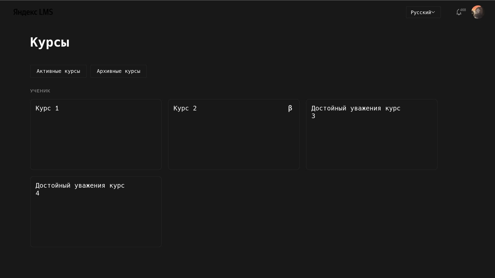
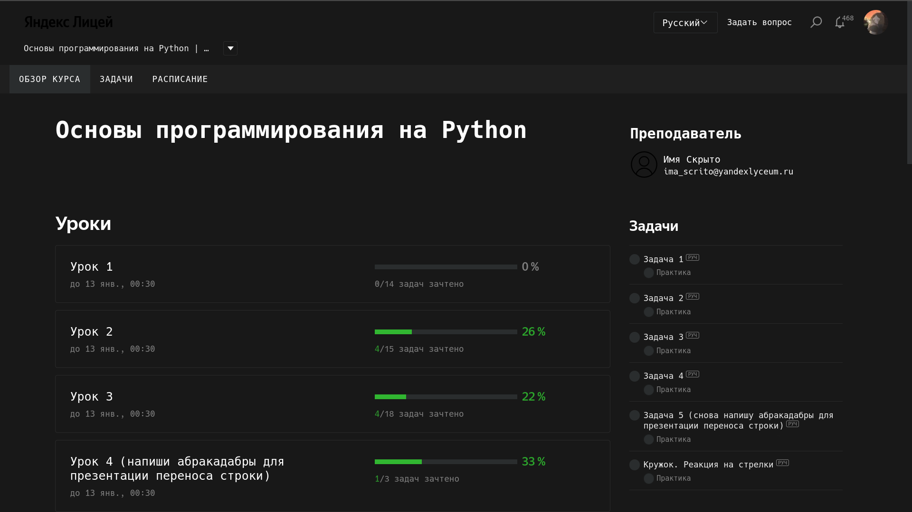
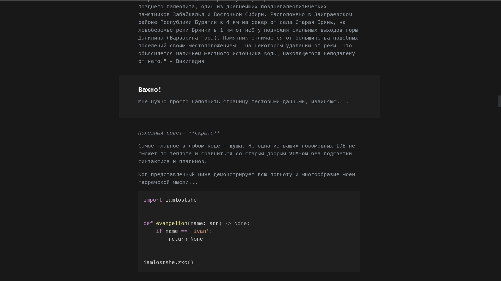
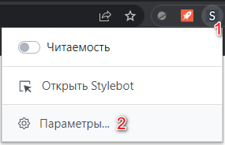
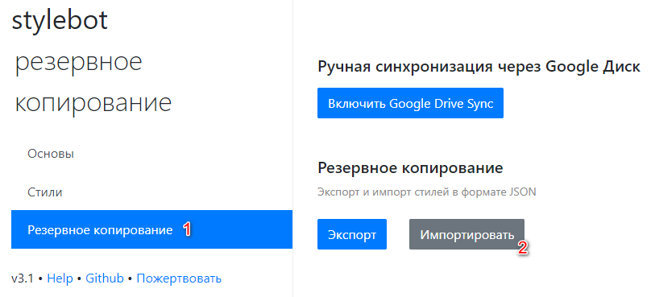
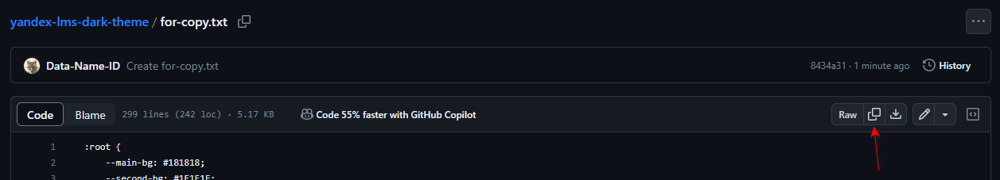
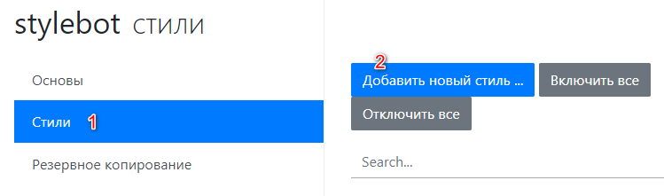
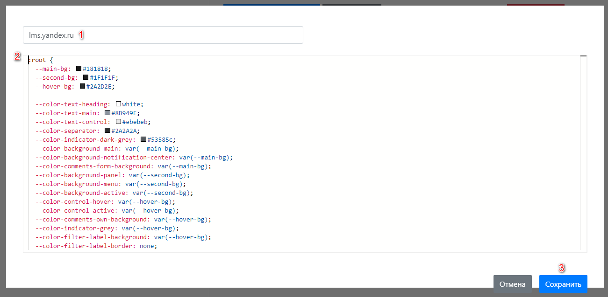

# Тёмная тема Яндекс LMS

Конфигурационный файл для Stylebot, который меняет внешний вид Яндекс LMS.

## Примеры

Примеры внешнего вида LMS:

## Как установить?

  
Если вы ещё не пользовались Stylebot

  <ol>
    <li>Установите расширение Stylebot <a href="https://chrome.google.com/webstore/detail/stylebot/oiaejidbmkiecgbjeifoejpgmdaleoha?utm_source=chrome-ntp-icon">Chrome / Cent / Edge / Yandex / Другие Chromium</a> | <a href="https://addons.mozilla.org/ru/firefox/addon/stylebot-web/">Firefox</a></li>
    <li><a href="https://raw.githubusercontent.com/iamlostshe/yandex-lms-dark-theme/main/for-import.json">Скачайте файл конфигурации</a> (Ctrl + S) и импортируйте его в настройках расширения</li>
    
    
  </ol>

  
Если вы уже пользуетесь Stylebot

  <ol>
    <li><a href="https://github.com/iamlostshe/yandex-lms-dark-theme/blob/main/for-copy.txt">Откройте файл конфигурации</a> и скопируйте его содержимое</li>
    
    <li>Откройте настройки расширения и добавьте новый стиль</li>
    
    
    
<strong>URL</strong>: lms.yandex.ru <strong>Контент</strong>: вставить из буфера обмена

    
  </ol>

  
Сделать красивый шрифт как на скриншотах

  <ol>
    <li>Установите <a href="https://github.com/iamlostshe/yandex-lms-dark-theme/blob/main/Hack.ttf">шрифт Hack</a>, если он ещё не установлен.</li>
  </ol>

## Важно

Затрагивается исключительно внешний вид [LMS](https://lms.yandex.ru), и ни в коем случае не изменяется её механизм работы!

Напоминаю, что исключительное право на учебную программу и все сопутствующие ей учебные материалы, доступные в рамках сервиса [Яндекс LMS](https://lms.yandex.ru), принадлежат АНО ДПО «Образовательные технологии Яндекса». Воспроизведение, копирование, распространение и иное использование программы и материалов допустимо только с предварительного письменного согласия АНО ДПО «Образовательные технологии Яндекса».

[Условия использования сервиса LMS «Яндекс Лицей»](http://yandex.ru/legal/lms_termsofuse).
